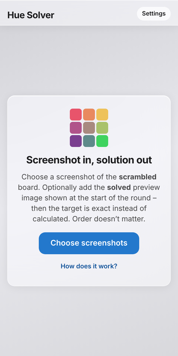

# Hue Solver

Stuck on a level in **I Love Hue** or **I Love Hue Too**? Take a screenshot, load it into Hue Solver and it shows you the fewest swaps to finish the puzzle, a few moves at a time, drawn right on top of your board.

Your screenshots stay on your phone. There's no account, no upload and no tracking. It works offline once opened and speaks English, German and Dutch.

> Unofficial fan project, not affiliated with the makers of I Love Hue. Game names and artwork belong to their owners.

## Open the app

**[herr-el.github.io/hue-solver](https://herr-el.github.io/hue-solver/)**

To keep it on your home screen like any other app:

- **iPhone / iPad:** open the link in Safari, tap Share, then **Add to Home Screen**
- **Android:** open the link in Chrome, tap ⋮, then **Install app**
- **Computer:** Chrome and Edge show an install icon in the address bar

## How to use it

1. Open a level and take a screenshot before you move anything.
2. In Hue Solver, tap the big button and pick the screenshot.
3. For a perfect result, also add a screenshot of the finished picture the game shows when the level starts.
4. Drag the tile with the ring onto 1, then 2, then 3, and tap **›** for the next round. Hold the eye to peek at the finished picture.

If a warning shows up, tap **Correct fixed tiles** and tap any fixed tile (the ones with a dot) it missed.

## Run your own copy

Most people don't need this. If you'd like your own version, for example to change something, fork this repository and turn on GitHub Pages:

1. Click **Fork**, then **Create fork**.
2. In your fork, open **Settings → Pages**.
3. Choose **Deploy from a branch**, branch **main**, folder **/ (root)**, and save.
4. A minute later it's live at `https://YOUR-NAME.github.io/hue-solver/`.

Use **Sync fork** to pull in updates later. Self-hosting with Docker or on any web space is covered in [CONTRIBUTING.md](CONTRIBUTING.md).

## Limits

- Only the swap mechanic is supported.
- Use the original screenshot. Photos of the screen or images squashed by a messenger can confuse it.
- Boards with three or more tile shapes don't always come out right.

Found a board it gets wrong? Open an issue and attach the screenshot.

## Licence

[MIT](LICENSE) © herr-el
